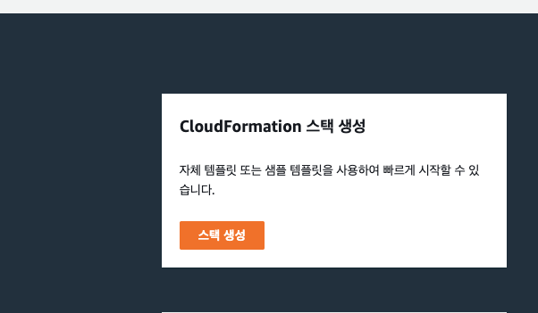
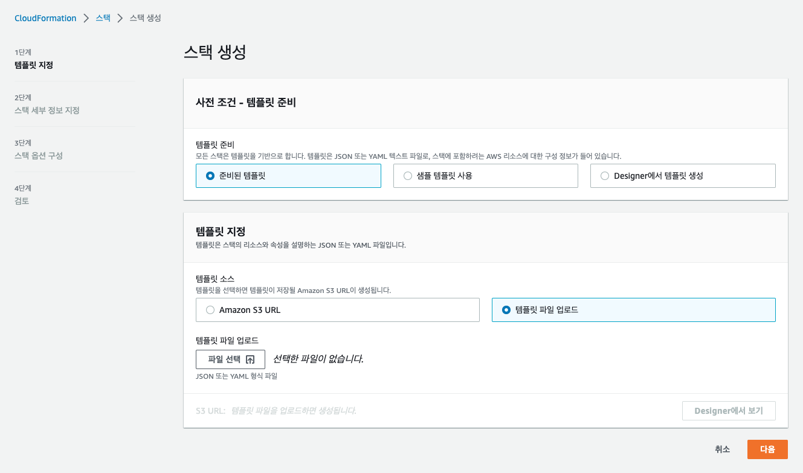
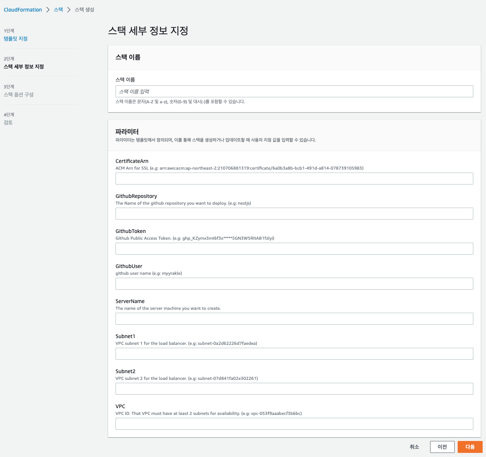
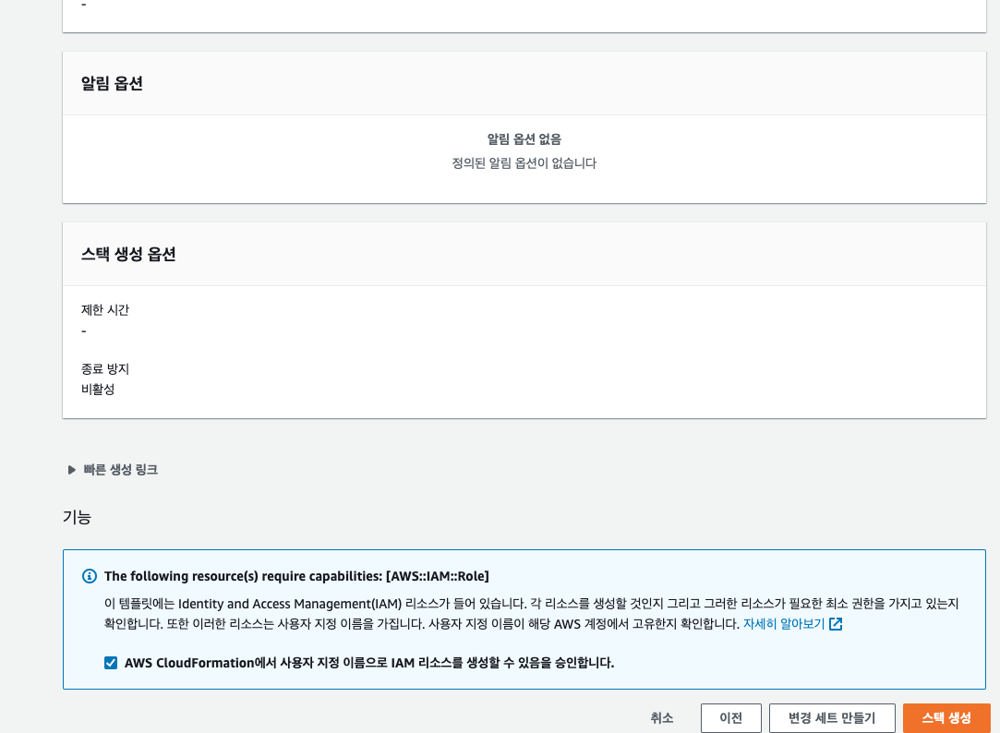
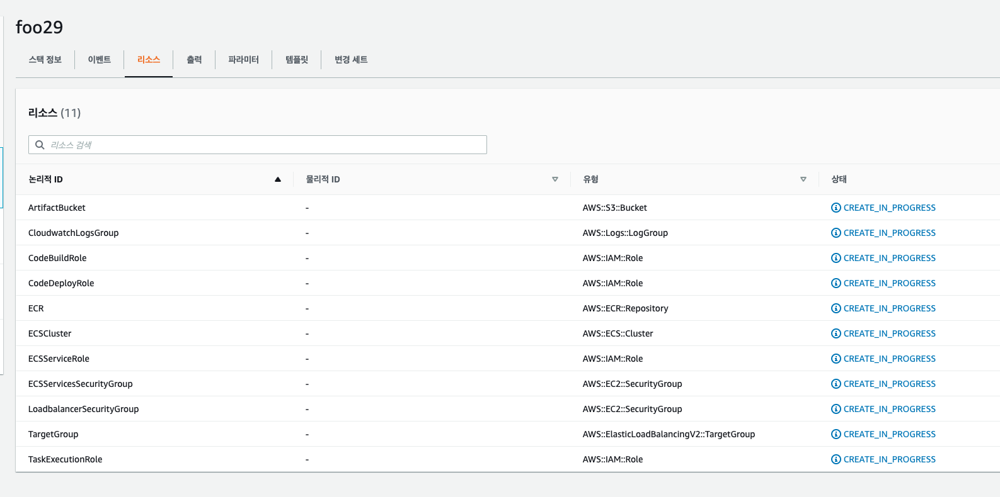

# CloudFormation

- AWS Cloudformation을 사용한 인프라 자동 템플릿소스 및 문서입니다.
- 각 디렉터리의 README를 참조하여 설정하시면 됩니다.

## 공통 사용법

1. cloudformation 콘솔 탭으로 이동합니다.
2. 스택 생성을 클릭합니다.
   
3. 템플릿 파일 업로드를 선택해, 구성하길 원하는 template.json을 업로드합니다.
   
4. 문서의 설명을 참고해서 매개변수 값들을 입력합니다.
   
5. 필요에 따라 기타 설정값들을 확인하고 스택 생성을 클릭합니다. (기본값으로 주고 무시해도 무방합니다.)
   
6. 그럼 다음과 같이 리소스들이 의존관계에 따라 적절하게 자동으로 구성됩니다. 삭제시에도 해당 구성 단위가 자동으로 정리됩니다.
   

## 소원수리

- sssang97@naver.com
