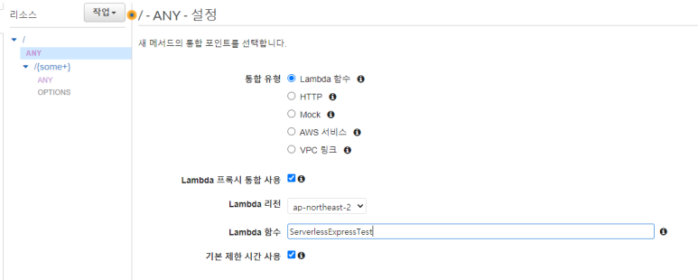

# aws-lambda-express-template

Express를 AWS Lambda로 사용하기 위한 가이드 및 템플릿입니다.

## 사전 준비물

-   AWS Lambda
-   테스트를 위한 SAM CLI: https://aws.amazon.com/ko/serverless/sam/
-   테스트를 위한 Docker (SAM 로컬 테스트에 필요)
-   배포를 위한 AWS CLI: https://docs.aws.amazon.com/ko_kr/cli/latest/userguide/install-cliv2.html

##

## Lambda 설정

### 1. Lambda 게이트웨이 설정

-   일반적인 HTTP 서버의 형태로 접근할 수 있게 게이트웨이를 추가해 경로를 설정해준다. 게이트웨이의 형식은 Restful API여야 한다.

-   기존의 리소스는 삭제하고, "/"와 "/{some+}" 경로의 리소스를 추가한다. METHOD는 ANY, 통합 유형은 Lambda 함수 프록시로 한다.



-   설정 완료시 수정사항을 배포한다.

### 2. 핸들러 설정

-   런타임 설정에서 핸들러 값을 `src/index.handler`로 변경

##

## 연동 및 테스트

### 1. Express 소스 연동

Express 소스 연동은 어려울 것이 없다. 기존의 프로젝트 디렉토리를 express 디렉토리에 위치시키고, 다음과 같이 뒷부분에 미들웨어를 등록해준다.

```
const awsServerlessExpressMiddleware = require("aws-serverless-express/middleware");
app.use(awsServerlessExpressMiddleware.eventContext());
```

그리고 express에서 생성한 express 객체를 index 핸들러에서 가져다쓸 수 있도록 경로를 확인해준다.

```
const serverlessExpress = require("aws-serverless-express");

const app = require("./express/app"); // 이 경로가 맞는지. 서버 객체를 export하고 있는지.

const server = serverlessExpress.createServer(app);

exports.handler = (event, context, callback) => {
    console.log(`EVENT: ${JSON.stringify(event)}`);
    serverlessExpress.proxy(server, event, context);
};

```

### 2. 로컬 서버 실행

-   루트 디렉토리에서 의존성을 설치하고, Express 프로젝트 디렉토리에서 의존성을 설치한 후, OS에 따라 `start.sh`(Linux)나 `start.cmd`(Windows)를 실행한다.

어댑터 의존성 설치

```
cd src
npm i
```

express 소스 의존성 설치

```
cd src/express
npm i
```

테스트 서버 실행

```
./start.sh # Linux or Mac
./start.cmd # Windows
```

##

## 배포

### 1. AWS CLI 로그인

-   액세스 키와 시크릿 키를 사용해 로그인한다. (없다면 IAM 콘솔에서 사용자를 추가해 발급)

```
aws configure
```

### 2. 배포

-   OS에 따라 `deploy.sh`(Linux)나 `deploy.cmd`(Windows)를 실행한다.
-   처음 실행하기 전에 해당 커맨드 파일을 열어서, `express_test`을 배포할 Lambda 함수명으로 치환한다.

##

## 레이어

### 1. 모듈 관리

-   모듈은 가급적 node_modules를 직접 올리지 않고, Layer로 업로드해 연동하는 방식을 취한다.
-   Layer는 node_modules가 포함된 파일을 압축률 없이 압축해 업로드하면 된다.
-   Layer로 모듈을 올릴 경우 배포 파일을 열어 압축 명령에 node_module를 무시하게 수정한다.

```
# Windows
tar.exe -a -c -f deploy.zip src/express src/index.js --exclude ./src/express/node_modules
```

```
# Linux or Mac
zip deploy.zip -r src/express src/index.js --exclude=./src/express/node_modules
```

-   Layer를 관리하기가 번거롭고 모듈의 크기가 크지 않다면 그냥 올려도 되긴 한다.
